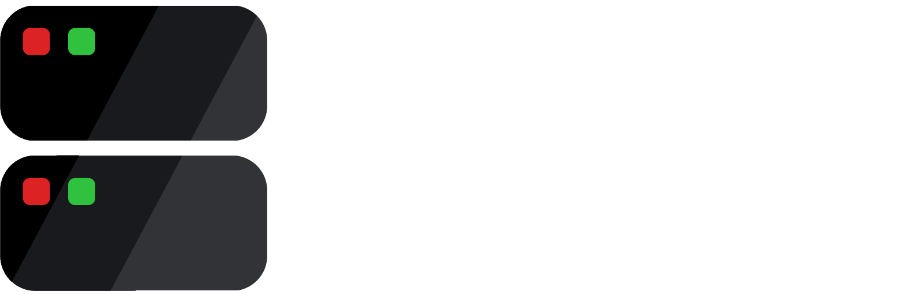
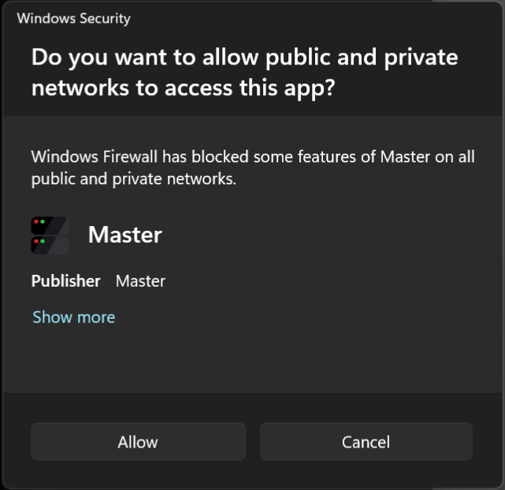

# Pidgeon Render Farm

Pidgeon Render Farm is a **P2P** (peer to peer - no third party) render farm software. Because **no third party** server is involved, you don't need an **internet connection**, just a local network. It allows you to use the computation power of multiple machines (e.g. macBook, desktop and laptop) to render on one (Blender) project. For now you can only render animations with PRF.

### Note
You may have to configure your firewall. [See troubleshooting section for more details](https://github.com/PidgeonTools/PidgeonRenderFarm#server-socket-wont-start).

## What makes PidgeonRenderFarm stand out?
- Very **customizable**
- **Tight integration with other Addons by PidgeonTools**
- **Secure**, because of P2P
- Works in shell only
- **Free support**
- **Freeware**
- Keeps your data on your devices
- Supports many operating systems
- **No  internet connection required** / works in LAN

## Requirements
- **RAM:**        <50 MB + RAM for Blender
- **Storage:**    ~200 kb (for Client and Master each) + storage for projects
- **Network:**    **No internet** connection required, just a local network

### Operating System
Modern **Windows** (7 and above), **Linux** and **MacOS** are supported. Though only the Windows and Linux versions are tested.

-> You help testing by using the render farm and filling out [this form](https://docs.google.com/forms/d/e/1FAIpQLSf77tLntJEPKpRnBiI6ITCFw2YQwGMHTeO-uuuhtMg1rG7fdA/viewform?usp=sf_link), creating an [issue on GitHub](https://github.com/PidgeonTools/PidgeonRenderFarm/issues/new?template=bug_report.md) or by contacting us on [Discord](https://discord.gg/cnFdGQP)!

## Future Plans
- [ ] Support for software other than Blender
- [ ] ❗ Support for **Multiple Blender** versions
- [x] ❗ Rework render engine system
- [ ] Support for **custom Blender builds** (e.g. E-Cycles)
- [x] ❗ Support for **custom render engines** (e.g. Radeon Pro Render)
- [ ] Support for non-animation projects
- [ ] ❗ Master handling **multiple connections**
- [x] Bandwidth saving mode (**Chunks**)
- [x] Automatically detecting render engine
- [ ] 💡 Automatic Blender download
- [x] GUI (**Super Render Farm**)

❗ = important

💡 = just a rough idea

⏱️ = halted

## Installation
The installation process is the same for the Client and Master
1. Download the latest realse for your OS (for Windows there are pre-compiled versions)
2. Extract the content of the zip file

## Setup
### Master
1. If you are on Windows double click the ``Master.exe`` to execute it, else execute it using the command ``mono Master.exe`` in the terminal (Be sure to use the correct .exe for your OS)
2. Choose if you want to enable logging (it is recommended to set this to on)
3. Choose which port to use. If you are not sure just leave it empty (Port ``8080`` will be used)
4. Next up provide the program with your Blender installation. Do this by pasting the path of the executable into the program. (If you have it installed via steam, right click Blender in the libary then go to ``manage`` -> ``Browse local files``)
5. Choose if you want to allow data collection. See a list of the data [here](https://github.com/PidgeonTools/PidgeonRenderFarm#do-you-collect-any-data)
6. Now your Master is ready!

### Client
1. If you are on Windows double click the ``Client.exe`` to execute it, else execute it using the command ``mono Client.exe`` in the terminal (Be sure to use the correct .exe for your OS)
2. Choose if you want to enable logging (it is recommended to set this to on)
3. Add one Master in the next step. A valid input looks like this: ``127.0.0.1:8080`` (keep in mind that you have to replace it with your Masters IP and Port; see the [FAQ](https://github.com/PidgeonTools/PidgeonRenderFarm#where-do-i-find-the-ip) to find out how you can get your IP)
4. Next up provide the program with your Blender installation. Do this by pasting the path of the executable into the program. (If you have it installed via steam, right click Blender in the libary then go to ``manage`` -> ``Browse local files``)
5. Now you choose which device you want to use for rendering. See the [FAQ](https://github.com/PidgeonTools/PidgeonRenderFarm#what-are-the-hardware-requirements-for-the-different-render-devicesapis) for a detailed description
6. If you decided to use your GPU for rendering you now have the option to enable hybrid rendering. You really have to try this out, as it only helps for some devices.
7. Stand by for a second and choose whether you want to pick allowed render engines on your own, or if you want to just allow all.
8. (optional) Select the engines to allow one by one from the list. If you wish to finish your selection use the "That is it, I don't want to allow more engines" option.
9. Choose if you want to allow data collection. See a list of the data [here](https://github.com/PidgeonTools/PidgeonRenderFarm#do-you-collect-any-data)

Advanced (optional)

10. (optional) Now pick the amount of CPU threads to use (even if you don't render with the CPU, it is used for compositing)
11. (optional, currently not aviable) If you want to restrain the RAM usage of projects, then type a value in GB. In case you don't want a limit you just type ``0`` or leave it empty
12. (optional) Same thing goes for the time limit (which limits the render time per frame. E.g. your Master estimated 50 seconds and your Clients limit is 30 seconds, the Client will deny this project)
13. Hit ``Start Client`` and your Client is ready!

## Project Setup
1. In the main menu choose ``New Project``
2. Now enter the path of your .Blend file
3. Decide whether you want to use Super Fast Render, to optimize the scene, before rendering
4. Decide if you want the Master to render a test frame - the test render will be used to clalculate the estimated time per frame (if you have no limit on your Client, this makes no sense).
5. Pick a chunk size. (must be a number greater than 0)
6. The master now opens your project to obtain informations like the selected render engine and Blender version
7. After this is done, your Master now waits for Clients

## Troubleshooting
### Server socket won't start
In most cases this is due to the settings of your **firewall**. You can see if it is the case for you by following the steps below. If that doesn't work visit our [Discord Server](https://discord.gg/cnFdGQP).

#### Windows
Click "🛡️Allow access"

or go to ``Control Panel`` -> ``System and Security`` -> ``Windows Defender Firewall`` -> ``Advanced settings`` -> add your custom (TCP)-port to the firewall.

#### Linux
Run the following commands. It will add an **firewall exception**. Be sure to **replace ``<your port>``** with the one you set in the settings!

``firewall-cmd --permanent --add-port=<your port>/tcp``

``firewall-cmd --reload``

#### MacOS
It is the easiest to just dissable the firewall entirely.

## Info
[Do you have questions? Join the Discord!](https://discord.gg/cnFdGQP)

## FAQ
### Why should I turn logging on?
Logging allows us to help you when encountering problems. Because the logs contain the errors (thrown by the compiler).

### Where do I find the IP?
When creating a new project you can find the Masters IP in the top. It reads ``Master IP adress: xxx.xxx.xxx.xxx``
Alternatively you can use the command ``ipconfig`` in the command promt (open it by pressing the Windows key and typing ``cmd``). On Linux you can use ``ip address`` in the terminal.
On mac you go into the ``System Preferences`` -> ``Network`` -> Selct your network -> ``Advanced`` -> ``TCP/IP`` and what you want is the ``IPv4 Address``

### What is the difference between CRF and CBR?
- **CRF:**	Constant **Quality** (unpredictable file size)
- **CBR:**	Constant **Bitrate** (somewhat unpredictable quality)

### What does the Chunks feature do/How does it work?
The chunks feature allows Client to render multiple frames at once. E.g. instead of rendering only one frame and then reporting to the master, the Client will render from frame 1 to 25 and after all frames are done he will report back and provide the master with the results. It is recommended to use this feature.

### Why would I add multiple Masters in the Client? - Not aviable yet
In case the **connection to the main Master fails** (because it is offline or you are uploading projects from different machines), the Client will **automatically** use another connection of the ones you added. In conclusion it is a nice to have, but if you don't need it just add a single connection.

### What are the hardware requirements for the different render devices/APIs?
- **CPU:**	No requirement
- **CUDA:**	Nvidia GPUs with CUDA version >= 3.0 (find the version of yours at https://developer.nvidia.com/cuda-gpus)
- **OptiX:**	Nvidia GPUs with CUDA version >= 5.0 (find the version of yours at https://developer.nvidia.com/cuda-gpus)
- **HIP:**	AMD GPUs with Vega architecture or newer
- **oneAPI:**	Intel Arc A-Series GPU
- **METAL:**	AMD or Intel GPU
- **OPENCL:**	AMD GPU with GCN 2 architecture or newer

### What are the software requirements for the different render devices/APIs?
- **CPU:**	Any Blender version
- **CUDA:**	Any Blender version
- **OptiX:**	Blender 2.81 or newer and driver version 470 or newer
- **HIP:**	Blender 3.0 or newer and Radeon Software 21.12.1 (Windows)/Radeon Software 22.10 or ROCm 5.3 (Linux)
- **oneAPI:**	Blender 3.3 or newer and Intel Graphics Driver 30.0.101.4032 (Windows)/intel-level-zero-gpu package 22.10.24931 (Linux)
- **METAL:**	Blender 3.1 or newer and macOS 13.0 or newer
- **OPENCL:**	Blender 2.93 or older

### Do you collect any data?
**No!** Unless you decide to allow the collection of data in the setup process, but even then the data remains on your system. We **won't have any access** to it! We only have access to the data if you decide to send us your data, which has to be done manually. The data collected contains **anonymous informations** about your system. Full list of data collected: ``OS version``, ``CPU model``, ``GPU model``, ``RAM``

