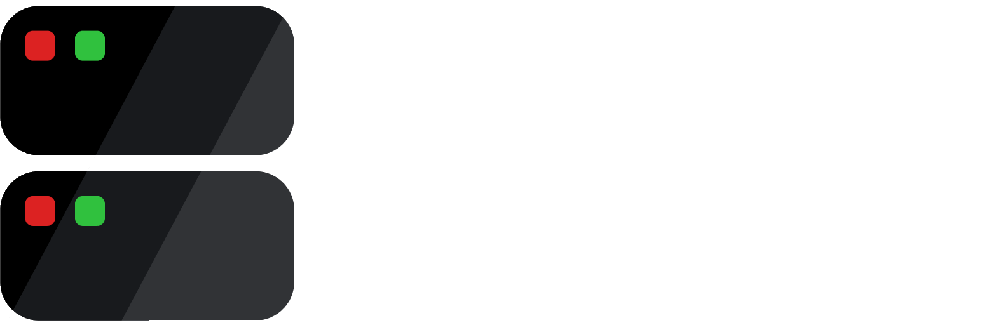

# Pidgeon Render Farm
<picture>
  <source media="(prefers-color-scheme: dark)" srcset="images/PRF_light.png">
  <source media="(prefers-color-scheme: light)" srcset="images/PRF_dark.png">
  
</picture>

## 🥳 Announcing Pidgeon Render Farm Next
The newest version of Pidgeon Render Farm is coming soon!
The "Next" update includes a huge rework of PRF as you know it.
To boost the UX and easy of use a web interface is being implemented, which will help you to easily set up your render farm and manage your projects.

Additionally, there is a big focus on fault tolerance, so that you won't need to worry about client (now called node) crashing overnight and your render being stuck when you wake up.

### 🤓 There is something for the developers too!
Pidgeon Render Farm Next also includes an extensive rest API, which allows for 3rd party integrations!

## What is Pidgeon Render Farm?
Pidgeon Render Farm is an innovative, Client-Server render farm software that empowers you to harness the computational power of **multiple devices**, such as your MacBook, desktop, and laptop, to render a single Blender project. This software operates on a **local network**, **eliminating the need for an internet connection and third-party servers**².

## What makes Pidgeon Render Farm stand out?
- **Free and Open Source**: Pidgeon Render Farm is open source, making it accessible to all - you can confirm the security and quality of Pidgeon Render Farm on your own.
- **Customizability**: Pidgeon Render Farm is highly customizable, allowing you to tailor the software to your specific needs.
- **Integration**: It integrates seamlessly with other addons by PidgeonTools, enhancing its functionality.
- **Security**: No data is shared. Your data is yours and won't leave your devices.
- **Support**: Free support is available to help you navigate any challenges.
- **Compatibility**: The software supports many operating systems, including modern Windows (10 and above), Linux, and MacOS¹.

## Why Pidgeon Render Farm?
By choosing Pidgeon Render Farm, you're choosing a solution that's secure, customizable, and supportive of your local render farm needs.

## Important links
[Quick start guide](QUICK_START.md)

[Troubleshooting](TROUBLESHOOTING.md)

[Frequently Asked Questions](FAQ.md)

[Development progress](https://github.com/orgs/PidgeonTools/projects/5)

[Roadmap](https://github.com/PidgeonTools/PidgeonRenderFarm/milestones)

## Requirements
- **RAM:**        100 MB RAM + RAM for Blender
- **Storage:**    ~60 MB (for Client and Master each) + storage for projects
- **Network:**    **No internet** connection required, just a local network

### Operating System
Modern **Windows** (10 and above) and **Linux** are actively supported. MacOS binaries are not aviable, as we want to ensure that you receive a tested product. You can still obtain the bins by asking on [our Discord server](https://discord.gg/cnFdGQP)

## Future Plans
- [ ] ⏱️Support for software other than Blender
- [x] ❗ Support for **Multiple Blender** versions
- [x] ❗ Rework render engine system
- [ ] Support for **custom Blender builds** (e.g. E-Cycles)
- [x] ❗ Support for **custom render engines** (e.g. Radeon Pro Render)
- [ ] Support for non-animation projects
- [x] ❗ Master handling **multiple connections**
- [x] Bandwidth saving mode (**Batches**)
- [x] Automatically detect render engine
- [ ] 💡 Automatic Blender download
- [x] GUI (**Super Render Farm**)

❗ = important

💡 = just a rough idea

⏱️ = halted

## Info
Do you have questions or encounter any problems? [Contact us on Discord!](https://discord.gg/cnFdGQP)

-> You help testing by using the render farm and filling out [this form](https://app.formbricks.com/s/cljn7iccc0023qs0h9sxtjpc4), creating an [issue on GitHub](https://github.com/PidgeonTools/PidgeonRenderFarm/issues/new/choose) or by contacting us on [Discord](https://discord.gg/cnFdGQP)!

You may noticed that the installation guide, the FAQ and Troubleshooting are missing.
The installation guide moved [here](QUICK_START.md), Troubleshooting moved [here](TROUBLESHOOTING.md) and the FAQ moved [here](FAQ.md)

### Note
You may have to configure your firewall. [See troubleshooting section for more details](TROUBLESHOOTING.md#server-socket-wont-start).

¹ MacOS binaries are not provided by default, you can still obtain them by asking on [our Discord server](https://discord.gg/cnFdGQP). MacOS binaries are untested.

² You are still able to build your own shared (3rd-party) servers, so that even your friends can render your projects while they are in a different network. A VPN will work wonders.

## Want to actively support the development of Pidgeon Render Farm?
We prepared [this page](CONTRIBUTING.md) to get you started. Have a look!