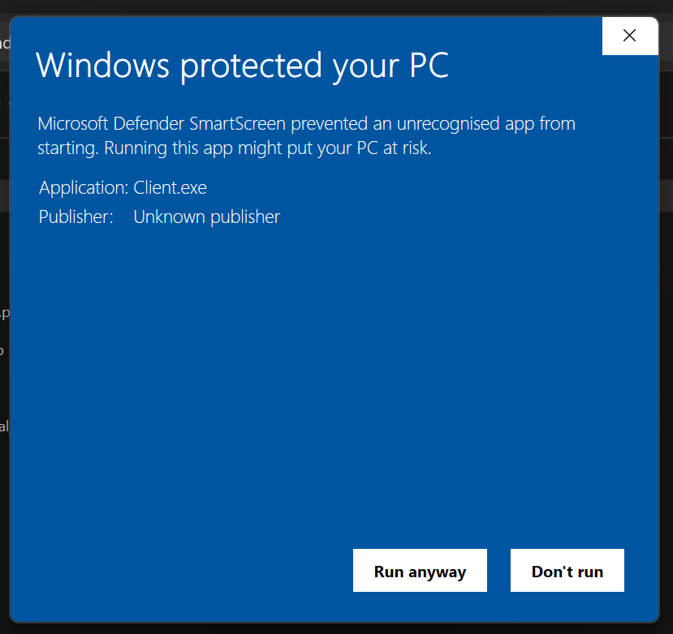

# ⚠️Troubleshooting
## Windows: "Windows protected your PC"
You may find yourself with a prompt that states "Windows protected your PC"

[answers.microsoft.com:](https://answers.microsoft.com/en-us/windows/forum/all/i-get-the-windows-protected-your-pc-message-is-my/c4d4f9c5-43b3-42ca-a199-dd253222915b)
> "This message will appear when Windows does not know anything about the app you are trying to run. Usually, this appears on apps with unknown publishers downloaded from open-source websites like Sourceforge."

To proceed anyways (only do this if you trust the application) press ``More info`` and the button ``Run anyway`` will appear. By pressing it you trust and start the program.

## Windows: Pidgeon Render Farm won't start (until 0.1.0-beta)
Since PRF is built using C#, which uses the dotnet-SDK, you will need to install the .NET 6.0 Runtime. You can download it from [here](https://dotnet.microsoft.com/download/dotnet/6.0). To learn more please visit the [FAQ](FAQ.md#what-is-dotnet-net).

## Linux: Pidgeon Render Farm won't start
You may see the terminal open and immediatly close with this error. The solution is rather simple:
1. Open the folder containing the application in the terminal
2. Type ``./Client`` or ``./Master`` depending on what you want to execute

## Server socket won't start
In most cases this is due to the settings of your **firewall**. You can see if it is the case for you by following the steps below. If that doesn't work visit our [Discord Server](https://discord.gg/cnFdGQP).

### Windows
Click "🛡️Allow access"

or go to ``Control Panel`` -> ``System and Security`` -> ``Windows Defender Firewall`` -> ``Advanced settings`` -> add your custom (TCP)-port to the firewall.

### Linux
Run the following commands. It will add an **firewall exception**. Be sure to **replace ``<your port>``** with the one you set in the settings!

``firewall-cmd --permanent --add-port=<your port>/tcp``

``firewall-cmd --reload``

### MacOS
It is the easiest to just disable the firewall entirely.

## The Client successfully connects to the Master, but isn't assigned any batch
This can have multiple causes. The most common one is a **Blender version missmatch** between your Master and your Client.
You need to make sure they use similar versions.

### What is a similar version?
A similar version is a version, where the first two numbers match each other.
For example the first two numbers for ``2.93.18`` would be ``2`` and ``93``, so the Client would have to use a version starting with the same numbers. Therefore a Client with the Blender version ``2.93.11`` has a similar version, but a Client with ``3.6.1`` does not.

### Why is this important in the first place?
We decided to force the Master and Client to use a similar version to prevent problems that might occur.
To give you an example think about the ``Geometry Nodes``, which were added in ``3.0.0``, a Blender installation with a version older than that would have trouble.

## Info
Do you have questions or encounter any problems? [Contact us on Discord!](https://discord.gg/cnFdGQP)